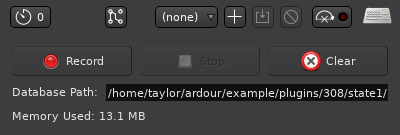

Freeze
======

Version 0.1.7

Freeze is an LV2 plugin for freezing tracks in a digital audio workstation—that
is, temporarily rendering a track as audio to reduce CPU/DSP load, as tracks
with large chains of CPU-heavy effects can make [buffer underruns][0] (xruns)
quite common. Some DAWs like Ardour support track freezing to a certain extent,
but Ardour, for example, cannot freeze MIDI tracks.

[0]: https://en.wikipedia.org/wiki/Buffer_underrun


Usage
-----



*Freeze running in [Ardour](https://ardour.org)*

To use Freeze, insert an instance of the plugin somewhere in a track’s chain of
effects. Plugins occurring before the Freeze instance can be turned off to
reduce CPU/DSP time once the audio is frozen, but they also won’t be
configurable without having to re-freeze the track.

After inserting the Freeze instance, open the GUI and click the Record button.
Then, in your project, play all sections where the track emits audio. This
ensures that Freeze can actually capture the audio that needs to be frozen. It
is not necessary to play sections where the track is silent, even if other
tracks aren’t.

After all sections have been played back, click the Stop button in the GUI.
The “Memory Used” text at the bottom of the GUI will show you how much memory
is being used to store the recorded audio. This amount of memory is present
both in RAM and on disk.

Then, disable or deactivate all plugins that occur before Freeze in the track’s
effect chain. This ensures that the plugins no longer consume CPU/DSP time. The
track will then be frozen and should behave as if the entire effect chain
were active, while being much less resource intensive.

If you change something in the track and need to re-freeze, enable all of the
plugins that occur before Freeze and play back the sections of the project that
have changed. If many sections have now become silent, it may be more
convenient to open Freeze’s GUI and click the Clear button, which clears all
recorded audio.


What’s new
----------

Version 0.1.7:

* The displayed memory usage in the GUI now updates continuously while
  recording.
* Samples with a small amplitude are no longer flushed to zero (but long
  sections of audio that consist entirely of small (< 1e−6) samples are
  still treated as silence).

Version 0.1.5:

* Fixed compilation errors due to deprecation warnings within GTK 2.


Dependencies
------------

* LV2 development files
* GTK 2 development files
* GCC
* GNU Make

On Debian GNU/Linux (and many derivatives), these can be installed by running
the following command as root (e.g., with ``sudo``):

```
apt-get install lv2-dev libgtk2.0-dev gcc make
```


Installation
------------

Run the following commands (you will need to have [Git] installed):

```
git clone https://github.com/taylordotfish/freeze ~/.lv2/freeze.lv2/
cd ~/.lv2/freeze.lv2/
make
```

[Git]: https://git-scm.com/


Development notes
-----------------

Freeze uses [autoheaders] to generate header files from the corresponding `.c`
files. If you make changes to a `.c` file, use autoheaders (or the wrapper
script [scripts/makeheader.sh]) to update the corresponding `.h` file.

[autoheaders]: https://github.com/taylordotfish/autoheaders
[scripts/makeheader.sh]: scripts/makeheader.sh


License
-------

Freeze is licensed under the GNU General Public License, version 3 or any later
version. See [LICENSE].

This README file has been released to the public domain using [CC0].

[LICENSE]: LICENSE
[CC0]: https://creativecommons.org/publicdomain/zero/1.0/
